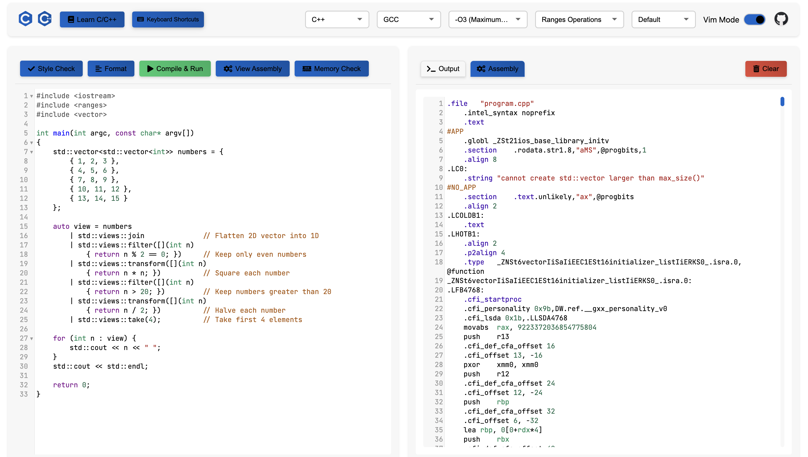

# WEB c/c++ code editor and compiler

This project is a web-based code editor and compiler for C/C++ programs. It allows users to write, compile, and run code directly in the browser. The application is built using JavaServer Pages (JSP) and runs on Apache Tomcat.

# sample



# Try it(no guarantee always available due to myself's server)

http://116.62.132.169:9527/webCpp/

---

# Features ✨

- **Syntax Highlighting**: Enhance code readability with different colors for keywords, strings, and comments.
- **Vim Keybindings**: Enable Vim-style navigation and editing for users familiar with Vim.
- **Show Assembly Code**: Provide an option to view the generated assembly code for the written code.
- **Save and Load Code**: Allow users to save their code snippets to local storage and load them when needed.
- **Multiple Themes**: Offer a variety of themes for personalized aesthetics.

# Shortcut Keys 🔑

- **Compile and Run**: `Ctrl/Cmd + Enter` to compile and run code.
- **Show Assembly Code**: `Ctrl/Cmd + Shift + A` to display assembly code.
- **Clear Output**: `Ctrl/Cmd + L` to clear output window.
- **Save to Local Storage**: `Ctrl/Cmd + S` to save current code.
- **Load from Local Storage**: `Ctrl/Cmd + O` to load previously saved code.
- **Format Code**: `Ctrl/Cmd + Alt + F` to format code for better readability.
- **Style Check** : `Ctrl/Cmd + Alt + C` to check code style.
- **Memory Check** : `Ctrl/Cmd + Alt + L` to check memory leak.

# Themes 🎨

- **Neo**: A modern theme with a futuristic design and vibrant colors.
- **Nord**: A polar night-inspired color palette that’s easy on the eyes.
- **Dracula**: A dark theme with vibrant colors for a striking contrast.
- **Monokai**: A classic dark theme with bright accents, popular among developers.
- **Material**: A material design-inspired theme that offers a modern aesthetic.
- **Ayu-dark**: A soothing dark theme with soft colors.
- **Gruvbox-dark**: A retro groove style with a comfortable color palette.
- **seti**: A vibrant theme with a dark background and colorful accents.

---

# setup guide

## Prerequisites

First, install the required packages:

```bash
sudo apt update
sudo apt install openjdk-11-jdk tomcat9 gcc g++ clang clang-format valgrind cppcheck
```

## Project Setup

Create the necessary directories in Tomcat's webapps folder:

```bash
# Clone the repository
git clone https://github.com/Pp3ng/webCpp.git

# Move the project to Tomcat's webapps folder
mv webCpp /var/lib/tomcat9/webapps/webCpp

# Change directory
cd /var/lib/tomcat9/webapps/webCpp

# Create required subdirectories
sudo mkdir tmp
```

### 2. Set File Permissions

Configure the correct permissions for the project:

```bash
# Change ownership
sudo chown -R tomcat:tomcat /var/lib/tomcat9/webapps/webCpp
# Change permissions
sudo chmod -R 755 /var/lib/tomcat9/webapps/webCpp
# Create tmp directory
sudo mkdir -p /var/lib/tomcat9/webapps/webCpp/tmp
# Change ownership and permissions
sudo chown -R tomcat:tomcat /var/lib/tomcat9/webapps/webCpp/tmp
# Change permissions
sudo chmod -R 777 /var/lib/tomcat9/webapps/webCpp/tmp
```

### 3. Configure Tomcat Security

Add necessary permissions to Tomcat's security policy:

```bash
# Edit the policy file
sudo vim /var/lib/tomcat9/conf/catalina.properties
```

Add these lines at the end of the file:

```
grant codeBase "file:${catalina.home}/webapps/code-editor/-" {
    permission java.io.FilePermission "/var/lib/tomcat9/webapps/code-editor/tmp/*", "read,write,delete,execute";
    permission java.io.FilePermission "/usr/bin/gcc", "execute";
    permission java.io.FilePermission "/usr/bin/g++", "execute";
    permission java.io.FilePermission "/usr/bin/clang", "execute";
    permission java.io.FilePermission "/usr/bin/clang++", "execute";
    permission java.io.FilePermission "/usr/bin/clang-format", "execute";
    permission java.io.FilePermission "/usr/bin/valgrind", "execute";
    permission java.lang.RuntimePermission "createClassLoader";
    permission java.lang.RuntimePermission "getClassLoader";
    permission java.lang.RuntimePermission "setContextClassLoader";
    permission java.lang.RuntimePermission "exitVM.0";
};
```

### 4. Start the Service

Restart Tomcat to apply changes:

```bash
sudo systemctl restart tomcat9
```

then you can visit http://localhost:8080/webCpp/ and enjoy it.

## Verification

### 1. Check Service Status

```bash
# Check Tomcat status
sudo systemctl status tomcat9

# View logs
sudo tail -f /var/lib/tomcat9/logs/catalina.out
```
