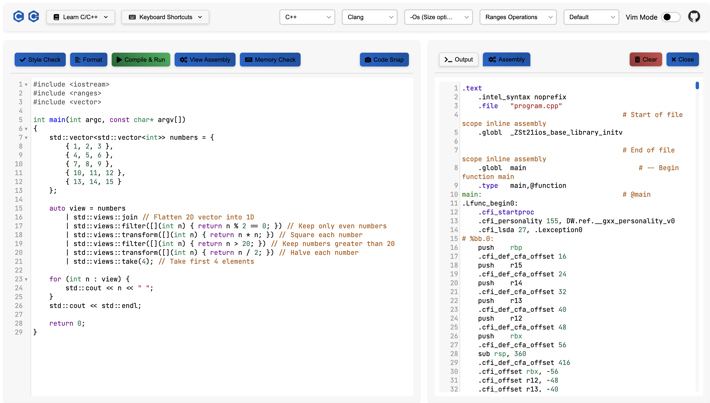
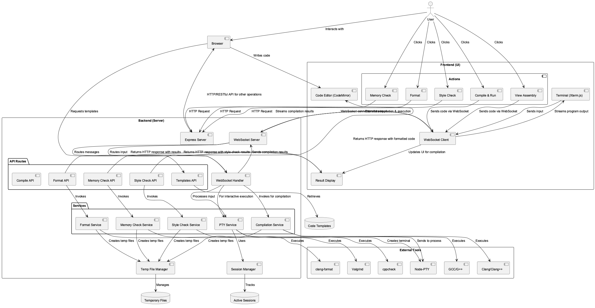

# CinCout

This project is a web IDE (integrated development environment) for _C/C++_ language. It allows users to write code, compile, analyze, and run C/C++ programs directly in their web browser. The application is built using `Node.js` for the backend and `React` for the frontend. It provides a user-friendly interface with rich features.

# Screenshots 📷

## Live Demo

Experience CinCout live at [https://cincout.fly.dev/](https://cincout.fly.dev/)

## Architecture

The project follows a clean separation between frontend and backend:

- **Frontend**: Browser-based editor with TypeScript and modern APIs
- **Backend**: Node.js server handling compilation, execution, and analysis
- **Communication**: WebSockets for real-time interaction between client and server

## Technical Stack

### Frontend

- **Core**: React with TypeScript
- **Editor**: CodeMirror with syntax highlighting and code folding
- **Terminal**: Xterm.js for interactive program execution
- **Build Tool**: Vite for fast development and optimized production builds
- **Communication**: Socket.IO client for real-time communication

### Backend

- **Runtime**: Node.js with TypeScript
- **API**: koa.js for HTTP endpoints
- **WebSockets**: Socket.IO for real-time communication
- **Process Management**: Node-PTY for spawning and managing compiler and program processes
- **Containerization**: Docker for consistent deployment

## Features ✨

| Category          | Feature                 | Description                                  |
| ----------------- | ----------------------- | -------------------------------------------- |
| **Code Editor**   | Syntax Highlighting     | Language-specific highlighting for C/C++     |
|                   | Code Folding            | Collapsible code blocks and sections         |
|                   | Vim Mode                | Optional Vim keybindings for editor          |
|                   | Code Snapshot           | Save code as image with syntax highlighting  |
| **Compilation**   | Multiple Compilers      | Support for GCC and Clang                    |
|                   | Optimization Levels     | Various optimization flags (-O0 to -O3, -Os) |
|                   | Assembly Generation     | View generated assembly code                 |
| **Execution**     | Real-time Program       | PTY-based terminal for interactive programs  |
|                   | Interactive Debugging   | GDB integration for debugging programs       |
|                   | WebSocket Communication | Bidirectional real-time communication        |
| **Code Analysis** | Style Checking          | Static code analysis with cppcheck           |
|                   | Memory Analysis         | Memory leak detection with Valgrind          |
|                   | Code Formatting         | Automatic code formatting with clang-format  |
| **UI/UX**         | Multiple Themes         | Various editor and terminal color schemes    |
|                   | Responsive Design       | Mobile-friendly interface and layout         |
|                   | Keyboard Shortcuts      | Customized shortcuts for common actions      |
|                   | Zen Mode                | Distraction-free coding mode                 |
| **Code Examples** | Template Library        | Built-in C/C++ code templates and examples   |

## Shortcut Keys 🔑

| Action           | Windows/Linux    | macOS      |
| ---------------- | ---------------- | ---------- |
| Compile and Run  | Ctrl + Enter     | ⌘ + Return |
| Save Code        | Ctrl + S         | ⌘ + S      |
| Code Snapshot    | Ctrl + P         | ⌘ + P      |
| Open Code File   | Ctrl + O         | ⌘ + O      |
| Toggle Code Fold | Ctrl + K         | ⌘ + K      |
| Zen Mode         | Ctrl + Shift + Z | ⌘ + ⇧ + Z  |
| View Assembly    | Alt + 1          | ^ + 1      |
| Format Code      | Alt + 2          | ^ + 2      |
| Style Check      | Alt + 3          | ^ + 3      |
| Memory Check     | Alt + 4          | ^ + 4      |
| Debug with GDB   | Alt + 5          | ^ + 5      |
| Close Output     | ESC              | ESC        |

## Future Improvements 🚀

- [x] Leverage `node-pty` and `xterm.js` for terminal emulation
- [x] Integrate `gdb` for debugging capabilities
- [ ] Use `React` for the frontend instead of `Vanilla TypeScript`
- [ ] Implement `clang-tidy` for code analysis
- [ ] Add more themes and customization options
- [ ] More modern `UI/UX` design
- [ ] Add cloud storage for saving code snippets

## Contributing 🤝

Welcome contributions! Please feel free to fork to make any creative changes you want and make a pull request.
