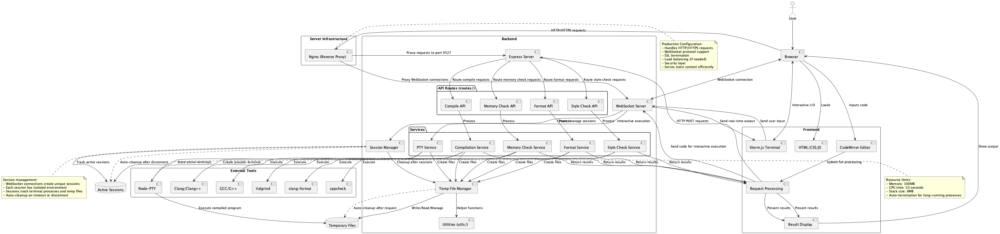

# WEB C/C++ Code Editor and Compiler

This project is a web-based code editor and compiler for C/C++ programs. It allows users to write, compile, and run code directly in the browser. The application is built using Node.js and Express.

---

# Screenshots 📷


# Try it (no guarantee always available due to myself's server)

http://39.105.45.170

---

# Features ✨

| Category              | Feature             | Description                              | Implementation                 |
| --------------------- | ------------------- | ---------------------------------------- | ------------------------------ |
| **Editor Core**       | Syntax Highlighting | Language-specific highlighting for C/C++ | `frontend/js/editor.js`        |
|                       | Code Folding        | Collapsible code blocks                  | `frontend/js/editor.js`        |
|                       | Auto Brackets       | Automatic closing of brackets            | `frontend/js/editor.js`        |
|                       | Font Size Control   | Ctrl + Mouse Wheel to adjust             | `frontend/js/editor.js`        |
| **Compilation**       | Multiple Compilers  | Support for GCC and Clang                | `backend/routes/compile.js`    |
|                       | Optimization Levels | -O0 to -O3 and -Os options               | `backend/routes/compile.js`    |
|                       | Assembly View       | View generated assembly code             | `backend/routes/compile.js`    |
|                       | Interactive Terminal| Real-time program interaction            | `backend/routes/compile.js`    |
| **Code Analysis**     | Style Checking      | Static code analysis with cppcheck       | `backend/routes/styleCheck.js` |
|                       | Memory Check        | Memory leak detection                    | `backend/routes/memcheck.js`   |
|                       | Code Formatting     | Automatic code formatting                | `backend/routes/format.js`     |
| **UI/UX**             | Multiple Themes     | 8 different color themes                 | `frontend/css/style.css`       |
|                       | Responsive Design   | Mobile-friendly layout                   | `frontend/css/style.css`       |
|                       | Custom Scrollbars   | Themed scrollbar design                  | `frontend/css/style.css`       |
|                       | Terminal Emulation  | Full terminal emulation with xterm.js    | `frontend/js/terminal.js`      |
| **Templates**         | Code Examples       | Built-in code templates                  | `frontend/js/templates.js`     |
|                       | Language Support    | Both C and C++ templates                 | `frontend/js/templates.js`     |
| **Development Tools** | External Resources  | Links to documentation                   | `frontend/index.html`          |
|                       | GitHub Integration  | Source code access                       | `frontend/index.html`          |

---

# Shortcut Keys 🔑

| Action           | Windows/Linux | macOS      |
| ---------------- | ------------- | ---------- |
| Compile and Run  | Ctrl + Enter  | ⌘ + Return |
| Clear Output     | Ctrl + L      | ⌘ + L      |
| Save Code        | Ctrl + S      | ⌘ + S      |
| Open Code File   | Ctrl + O      | ⌘ + O      |
| Toggle Code Fold | Ctrl + K      | ⌘ + K      |
| View Assembly    | Alt + 1       | ^ + 1      |
| Format Code      | Alt + 2       | ^ + 2      |
| Style Check      | Alt + 3       | ^ + 3      |
| Memory Check     | Alt + 4       | ^ + 4      |

---

# Themes 🎨

| Theme        | Description                                            |
| ------------ | ------------------------------------------------------ |
| Default      | Clean and minimalist design with balanced contrast     |
| Nord         | Arctic-inspired color scheme with cool, soothing tones |
| Dracula      | Dark theme with vivid, high-contrast colors            |
| Monokai      | Classic dark theme favored by developers               |
| Material     | Modern design following Material guidelines            |
| Ayu Dark     | Soft dark theme with warm accents                      |
| Gruvbox Dark | Retro-style theme with earthy colors                   |
| Seti         | Modern dark theme with bright accent colors            |
| Panda Syntax | Friendly dark theme with pastel accents                |

---

# Architecture



---

# Setup Guide

## Prerequisites

First, install the required packages:

```bash
# For Debian/Ubuntu
sudo apt update
sudo apt install nodejs npm gcc g++ clang clang-format valgrind cppcheck
```

## Project Setup

1. Clone the repository and install dependencies:

```bash
# Clone the repository
git clone https://github.com/Pp3ng/webCpp.git

# Change directory
cd webCpp

# Install dependencies
npm install
```

2. Start the application:

```bash
# Start the server
node backend/server.js
```

3. Access the application at http://localhost:9527

## Run as a Background Service (Optional)

### Using PM2 to Manage the Application

1. Install PM2:

```bash
# Install PM2 globally
npm install pm2 -g
```

2. Start the application with PM2:

```bash
# Start the application
pm2 start backend/server.js --name "webCpp"

# Set up startup script to run on server boot
pm2 startup
pm2 save
```

3. Common PM2 commands:

```bash
# Check application status
pm2 status

# Restart application
pm2 restart webCpp

# View logs
pm2 logs webCpp

# Stop application
pm2 stop webCpp

# Delete application from PM2
pm2 delete webCpp
```

### Using Nginx as a Reverse Proxy(Recommended)

1. Install Nginx:

```bash
sudo apt update
sudo apt install nginx
```

2. Create an Nginx configuration file:

```bash
sudo vi /etc/nginx/sites-available/webcpp
```

3. Add the following configuration:

```nginx
server {
    listen 80;
    server_name your-domain.com;  # Replace with your domain or server IP

    location / {
        proxy_pass http://localhost:9527;
        proxy_http_version 1.1;
        proxy_set_header Upgrade $http_upgrade;
        proxy_set_header Connection 'upgrade';
        proxy_set_header Host $host;
        proxy_cache_bypass $http_upgrade;
    }
}
```

4. Enable the site and restart Nginx:

```bash
sudo ln -s /etc/nginx/sites-available/webcpp /etc/nginx/sites-enabled/
sudo nginx -t  # Test if the configuration is valid
sudo systemctl restart nginx
```

5. Configure firewall to only allow Nginx and block direct access to port 9527:

```bash
sudo ufw allow 'Nginx Full'  # Allow HTTP and HTTPS through Nginx
sudo ufw deny 9527           # Block direct access to the application port
```

6. Optional: Configure the application to only listen on localhost (127.0.0.1)

For added security, you can modify the server.js file to only listen on localhost instead of all interfaces:

```javascript
// Find the server.listen line in backend/server.js
// Change from:
// server.listen(9527, () => { ... });
// To:
server.listen(9527, "127.0.0.1", () => {
  console.log("Server listening on http://localhost:9527");
});
```

This ensures application is only accessible through Nginx and not directly via port 9527 from the internet, adding an extra layer of security to deployment.

---

# Contributing 🤝

Welcome contributions! Please fell free to fork to make any creative changes you want and make a pull request.
